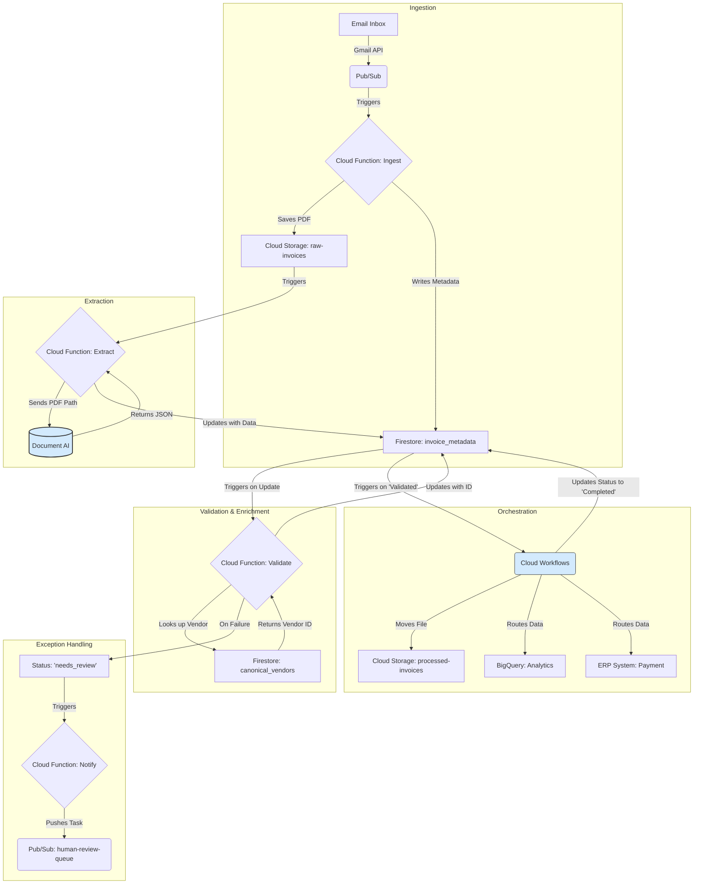

# Technical Architecture & Data Flow

This document provides a detailed description of the "Document AI First" architecture, its components, and the step-by-step data flow.

## 1. Architectural Philosophy

The core principle of this architecture is simplicity and robustness. Instead of building a complex, multi-step process to identify an invoice's vendor *before* processing, we send the document immediately to our most powerful tool: **Google Document AI**. The service reads the invoice and tells us the vendor, which simplifies the entire workflow and makes it resilient to changes in invoice layouts, fonts, or logos.

## 2. Visual Data Flow

The following diagram illustrates the end-to-end flow of data through the system, from email receipt to final destinations.

## 3. Step-by-Step Implementation Details

### Step 1: Invoice Ingestion
- **Trigger**: An email with an invoice attachment arrives in a designated Gmail inbox.
- **Process**:
    1. A Gmail push notification sends a message to a Pub/Sub topic.
    2. A subscribed Cloud Function retrieves the email and its PDF attachment via the Gmail API.
    3. The raw PDF is saved to a Cloud Storage bucket (`raw-invoices/`).
    4. A corresponding record is created in Firestore with initial metadata and a status of `"uploaded"`.

### Step 2: Core Data Extraction
- **Trigger**: A new file is created in the `raw-invoices/` Cloud Storage bucket.
- **Process**:
    1. The storage event triggers a second Cloud Function.
    2. This function calls the Document AI Invoice Processor, passing the file's location.
    3. Document AI returns a structured JSON object with all extracted fields (`vendor_name`, `invoice_id`, `line_items`, etc.).
    4. The function updates the invoice's Firestore record with the extracted data and sets the status to `"extracted"`.

### Step 3: Enrichment & Validation
- **Trigger**: The invoice's Firestore record is updated to a status of `"extracted"`.
- **Process**:
    1. A Firestore-triggered Cloud Function reads the `vendor_name` from the invoice data.
    2. It queries a `canonical_vendors` collection in Firestore to find a matching approved vendor and retrieve the internal `vendor_erp_id`.
    3. **Success**: If a match is found, the function updates the invoice record with the `vendor_erp_id` and sets the status to `"validated"`.
    4. **Failure**: If no match is found, the status is set to `"needs_review_new_vendor"` to trigger the exception flow.

### Step 4: Orchestration & Routing
- **Trigger**: The invoice's Firestore record is updated to a status of `"validated"`.
- **Process**:
    1. A Cloud Workflow is triggered to orchestrate the final actions.
    2. **File Management**: The workflow renames the original PDF for easy lookup (e.g., `VendorName_InvoiceID_Date.pdf`) and moves it to the `processed-invoices/` archive bucket.
    3. **Data Routing**: In parallel, the workflow sends the structured data to:
        - A BigQuery table for financial analytics.
        - The company's ERP system via a secure API call to queue the bill for payment.
    4. Upon completion, the workflow updates the Firestore status to `"completed"`.

### Step 5: Exception Handling & Human-in-the-Loop
- **Trigger**: An invoice's status is updated to any `"needs_review"` state.
- **Process**:
    1. A Cloud Function pushes a notification to a `human-review-queue` Pub/Sub topic, including the invoice ID and reason for failure.
    2. This queue can feed a simple task list for the accounts payable team (via email, Slack, or a simple web app).
    3. When a reviewer resolves the issue (e.g., adds the new vendor to the approved list), they trigger an action that re-runs the validation step, allowing the automated process to resume. This creates a simple feedback loop that makes the system self-improving.
